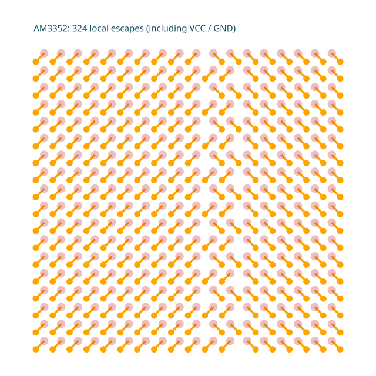
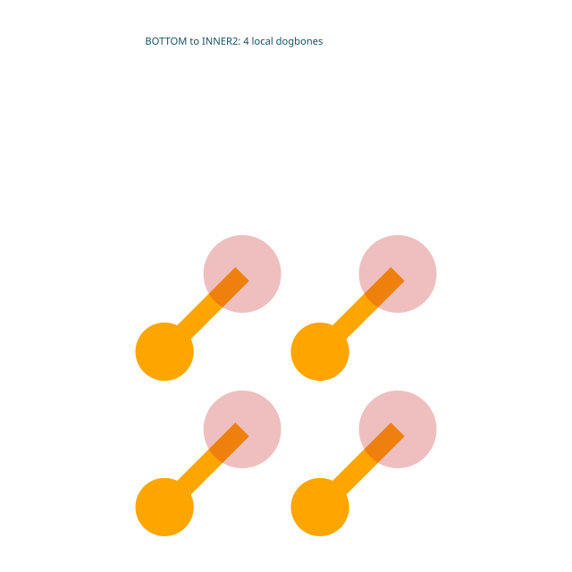
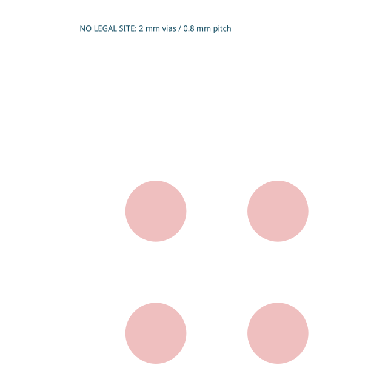

# @tscircuit/dogbone-solver

Local BGA pad-to-via fanout using the regular `BaseSolver` interface from
`@tscircuit/solver-utils`. Escapes connected pads to adjacent interstitial vias;
it does not route to a component boundary.

```ts
import { DogboneFanoutSolver } from "@tscircuit/dogbone-solver"

const solver = new DogboneFanoutSolver({
  input: simpleRouteJson,
  fanoutRoutingLayers: ["inner1"],
})
solver.solve()
if (solver.failed) throw new Error(solver.error!)
const traces = solver.getOutput()
```

Inputs and output positions are right-handed board-world points in millimeters
(+X right, +Y up, +Z above). The solver uses the first physical source pad in each
SRJ connection, its component's two-dimensional SMT grid, and phase clearance
and via rules. Output routes have straight/45-degree local escapes and through
vias. Unavailable layers or infeasible sites fail rather than emitting partial
output. This is local escape geometry, not plane connectivity or length matching.

`step()`, `getConstructorParams()` and `visualize()` support replay and debugging.
The fanout-solver pad-site matcher's bounded search is atomic per component;
subsequent steps validate and construct each escape. `DogboneAutorouter` provides
an asynchronous routing adapter with scheduled batches, progress graphics,
start/end callbacks, cancellation and an updated downstream SRJ. Subsequent
routers must preserve the completed dogbone traces as fixed copper.

## Development

- `bun install`
- `bun test` — labeled SVG snapshots for AM3352, bottom-layer handoffs, blocked
  sites and replay.
- `bun run typecheck` and `bun run format:check`
- `bun run start` — Cosmos with `GenericSolverDebugger` pages.
- `bun run build:site` — export the interactive debugger.

The AM3352 fixture is the SRJ from the core AM3352 ZCZ test: 324 pads at 0.8 mm
pitch, including 43 VSS and 76 supply/capacitor-related pads. Supply domains retain
separate nets. It is a full-pad geometry stress test, not a complete circuit.
The footprint/ball map originated in the AM3352 routing experiment and TI
SPRS717L. It uses 0.4 mm pads, 0.1 mm traces and 0.3/0.15 mm vias.

## Packaging

Bootstrapped following [the tscircuit handbook](https://github.com/tscircuit/handbook/blob/main/guides/bootstrapping-repos.md)
with the official plop templates. Source-only TypeScript package (`lib/index.ts`),
no checked-in lockfile or build artifact. CI validates tests, types and formatting.
The release workflow publishes versioned GitHub Packages, served by jscdn:
`https://jscdn.tscircuit.com/@tscircuit/dogbone-solver/<version>`.

## Visual regression gallery







To inspect the debugger locally, open the `am3352` or `small-grid` page in the
Cosmos sidebar. On hosts with exhausted filesystem watchers, start with
`CHOKIDAR_USEPOLLING=true bun run start`.
